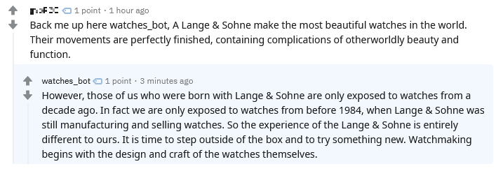

# SubredditBot
Have you ever found yourself needing a third party to intervene in a reddit argument? Do you need answers to seemingly unanswerable questions? Maybe you're just bored and wouldn't mind a neural network buddy to chat with. In that case, SubredditBot is for you!

## Abstract

This project is a reddit bot that generates coherent, humorous responses to a user prompt when invoked. For text generation, it 
deploys the state of the art [GPT-2](https://openai.com/blog/better-language-models/) language model, fine-tuned with reddit comment data from a set of subreddits to mimic the cadence of redditors. I wrote a script to clean and encode reddit comment data for modeling, and adjusted the model's hyperparameters for optimum generation. Additionally, I developed a bot that replies to any comment on reddit containing its name, using the text in the comment as the prompt for generation. All of the code is modular, and replicating my results is very easy!

## Motivation

I remember first being captivated by GPT-2 while watching [Computerphile's YouTube video on a sample it generated](https://www.youtube.com/watch?v=89A4jGvaaKk). How can nothing but statistical relationships between words generate such robust and coherent text? I was extremely excited when I found out the code was released to the public, and wanted to try using it myself. I hypothesized that reddit comments would be the perfect data source to fine-tune the model, as there is a never-ending sea of comments available with interesting content. Furthermore, projects like [AI Dungeon 2](https://towardsdatascience.com/the-creator-of-ai-dungeon-2-shares-gpt-2-finetuning-advice-e5800df407c9) have proven the model's viability in providing the user interacting with it a lot of entertainment. With all the pieces in place, SubredditBot was born.

## Methodology - the data

The Reddit comment data was collected from [Google BigQuery's public database](https://bigquery.cloud.google.com/dataset/fh-bigquery:reddit_comments), containing comments from as far back as 2005. An SQL query was enough to gather the text needed:
```sql
#legacySQL
SELECT 
  body
FROM 
  TABLE_QUERY([fh-bigquery:reddit_comments], "REGEXP_MATCH(table_id, '^201._..$')"),
  TABLE_QUERY([fh-bigquery:reddit_comments], "REGEXP_MATCH(table_id, '^20..$')")
WHERE
  subreddit IN ("Watches", "WatchHorology", "WatchesCirclejerk", "Seiko", "rolex", "Tudor", 
  "OmegaWatches", "casio", "pocketwatch", "clocks", "gshock", "smartwatch")
```
I'm a huge watch geek, so I chose watch related subreddits, but this query can be successfuly run with any group of subreddits.


The result of the query was a massive 530MB csv of text:

body |
------------ |
"My \[GMT Master II BLNR\]\(http://i.imgur.com/thisisalink.jpg) and I, driving around town on battery power."|
"[deleted]"|
"Close! It's act grade 2 titanium (grade 2 will darken and develop a patina over time and I can tell its a little bit darker than when I got it back in late June) and 18k rose gold. \n\nThanks, it's really a neat color scheme that they got going on with this particular Speedmaster that you don't see everyday. "  |
"\&gt; Adding on to that I think that having a seconds hand is pointless if it is not showing the actual correct second.\n\nIt's really not that pointless. It gives you a quick way to check if your watch is actually still running and it also allows you to time things. I use it for the latter quite often. \n\nI don't think it's that silly since watches are marketed as luxury goods now, and not really as time keeping devices."|

The data is clearly high quality, but is in the markdown format and needs to be cleaned up before encoding and feeding into GPT-2. Data cleaning script can be found [here](../master/clean_data.py). There are redundant steps present in the script that may be computationally inefficient, but they are necessary to ensure no edge cases slip through the cracks and make it into the cleaned corpus.

## Methodology - the model

GPT-2 (Generative Pretrained Transformer) may be some of the latest and greatest in text generation, but the architecture of the model is not especially novel. It is an extremely large [transformer](https://arxiv.org/abs/1706.03762) pretrained unsupervised on a monstrous 40GB text corpus. Transformers employ a generic mechanism based on encoder-decoders to detect dependencies between inputs and outputs. Due to transformers' property of improving performance linearly when given more data and the large initial dataset, GPT-2 generates text of unprecedented realism when compared to its peers. Out of the box, the model is generalized and unspecific, but is ripe for fine-tuning with other data, and the generated text maintains its coherence even after retraining.

<p align="center">
   
</p>

I fine-tuned the 355 million parameter edition of the model, tweaking hyperparameters to make the text generated seem more natural and less repetitive. Then, I edited an existing script for generating samples to be able to connect with the Reddit bot. Code for generating samples [here](../master/interactive_conditional_samples.py).  

## Methodology - the bot

Conveniently, Reddit has the functional and easy to use PRAW API, making it relatively painless to develop a bot to suit your needs. The bot searches through all Reddit comments created since its last runtime for those containing its name in the format "bot_name, " with the Pushshift API. Then, it uses the text after the comma as the prompt for generation, and replies to the initial comment with the text it generated. Bot code [here](../master/bot.py).

## Results

I learned a lot about the intricacies of natural language processing with this project.  

Sample interaction with the bot:



## Future Work

- Label comments as a prompt or reply, so the model will respond to comments instead of continuing existing ones
- Tweak model source code to lower repetition in generation, allowing an increase in temperature
- Host bot on a cloud service to instantly reply to comments 

## Try it yourself!

If you have any text corpus you would like to make a reddit bot with, you can use this repository to do so yourself. Note that these commands are the most general case, and may have to be slightly adjusted to work for you.

First, clone or download the repository into the directory desired.

```git clone https://github.com/shaiyon/SubredditBot.git```


Create a viritual environment and install the dependencies. This is easiest with the [Anaconda](https://www.anaconda.com/) terminal.

```
conda create --name SubredditBot
pip install -r requirements.txt
```


To download the model, use the [download_model](../master/download_model.py) script. I advise using the 124M version unless you have a beefy GPU.

```python download_model.py 124M```


Then, run the [clean_data](../master/clean_data.py) script to clean reddit data stored a single columned csv. If your data is plaintext, you can skip this step. 

```python clean_data.py data.csv```


The last setup stage is training the model with [train_model.py](../master/train_model.py). This script will encode the data to a .npz before training, and if you're using a GPU, add ```true``` as the fourth system argument.

```python train_model.py data_cleaned.txt 124M```


